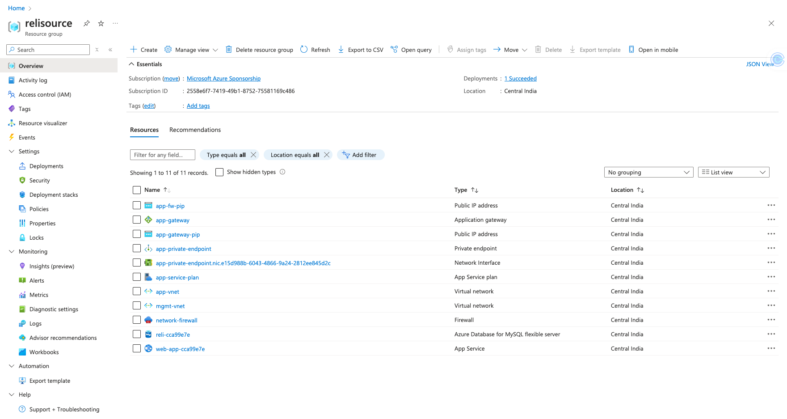

# Infrastructure Deployment and Application Deployment via GitHub Actions

## Overview

This project demonstrates a complete end-to-end setup for provisioning Azure infrastructure using Terraform and deploying a Node.js application via Docker using GitHub Actions. The project covers the following aspects:

1. **Infrastructure Setup**: Using Terraform to provision resources in Azure, including resource groups, virtual networks, subnets, application gateway, firewalls, MySQL database, and an Azure App Service.
2. **Dockerization of Application**: Packaging a Node.js application using Docker.
3. **Continuous Deployment Pipeline**: Automating the deployment of the Dockerized application to Azure App Service using GitHub Actions.

## Terraform Infrastructure Modules

The infrastructure setup is divided into multiple Terraform modules, each responsible for a specific aspect of the architecture. Below is a summary of each module:

### 1. **Resource Group (`resource_group`)**

- **Purpose**: Creates an Azure resource group named `relisource` to host all other resources.
- **Resources**: `azurerm_resource_group`

### 2. **Virtual Networks (`virtual_network`)**

- **Purpose**: Creates two virtual networks: `mgmt-vnet` and `app-vnet`.
- **Resources**: `azurerm_virtual_network`, `azurerm_subnet`

### 3. **VNet Peering (`vnet_peering`)**

- **Purpose**: Establishes peering between `mgmt-vnet` and `app-vnet`.
- **Resources**: `azurerm_virtual_network_peering`

### 4. **Application Gateway (`application_gateway`)**

- **Purpose**: Deploys an Azure Application Gateway within `mgmt-vnet` for routing and load balancing traffic to the Azure App Service.
- **Resources**: `azurerm_application_gateway`, `azurerm_public_ip`

### 5. **Firewall (`firewall`)**

- **Purpose**: Configures a firewall in `app-vnet` to allow traffic only from the application gateway.
- **Resources**: `azurerm_firewall`, `azurerm_firewall_network_rule_collection`

### 6. **MySQL Database (`mysql`)**

- **Purpose**: Provisions an Azure MySQL Flexible Server within `app-vnet`, configured with private access.
- **Resources**: `azurerm_mysql_flexible_server`, `azurerm_mysql_flexible_server_configuration`

### 7. **App Service (`app_service`)**

- **Purpose**: Deploys an Azure App Service within `app-vnet` for hosting the Node.js application, with VNet integration.
- **Resources**: `azurerm_app_service`, `azurerm_app_service_plan`, `azurerm_app_service_virtual_network_swift_connection`

## Prerequisites

Before running the Terraform code and the deployment pipeline, ensure the following prerequisites are met:

- **Azure CLI**: Installed and authenticated (`az login`).
- **Terraform**: Installed and configured.
- **Docker**: Installed for containerizing the Node.js application.
- **GitHub Repository Secrets**: Set up the following secrets in your GitHub repository:
  - `AZURE_CREDENTIALS`: JSON object containing Azure service principal credentials.
  - `AzureAppService_ContainerUsername`: DockerHub username.
  - `AzureAppService_ContainerPassword`: DockerHub password.
  - `AzureAppService_PublishProfile`: Azure App Service publish profile.

## How to Use

### 1. **Cloning the Repository**

````bash
git clone https://github.com/NayeemH/ReliSource-assignemnt-devops
cd ReliSource-assignemnt-devops/terraform
````
# Infrastructure Provisioning and Deployment Guide

## 1. Overview

This guide details the process for provisioning Azure infrastructure using Terraform and deploying a Dockerized Node.js application using GitHub Actions.

## 2. Infrastructure Provisioning with Terraform

- **Initialize and Plan Terraform:**
```bash
terraform init
terraform plan
````
- **Apply Infrastructure Configuration:**
```bash
terraform apply
````
This will create all the resources described in the Terraform modules.
- **Destroy Infrastructure:**
```bash
terraform destroy
````
Use this command to tear down all the resources when they are no longer needed.

## 3. Node.js Application Deployment

- **Dockerize the Application:** Ensure your Node.js application is correctly set up with a `Dockerfile` and `docker-compose.yml` (for local testing).

- **Push the Code to GitHub:** Push your application code, Dockerfile, and the `.github/workflows` directory to your GitHub repository.

## 4. GitHub Actions CI/CD Pipeline

The GitHub Actions pipeline is triggered on every push to the `main` branch. It performs the following steps:

- **Checkout the Code:** Fetches the latest code from the `main` branch.

- **Build Docker Image:** Uses the Dockerfile to build the Node.js application.

- **Push Docker Image:** Pushes the Docker image to DockerHub.

- **Deploy to Azure Web App:** Deploys the Docker image to the Azure App Service created via Terraform.

- **Manually Triggering the Workflow:** You can also manually trigger the deployment using the Actions tab in your GitHub repository.

## 5. Accessing the Application

After the pipeline completes, the application will be accessible via the public IP of the Azure App Service or the custom domain configured in the App Service settings.

To retrieve the URL, you can check the output of the deployment step in GitHub Actions or manually fetch it from the Azure portal.

## Visualizations

### Resource Visualizer



### Created Resources


## Troubleshooting

- **Terraform Errors:** Check for resource conflicts, misconfigurations, or missing dependencies.

- **GitHub Actions Failures:** Ensure secrets are correctly configured and DockerHub/Azure credentials are valid.

- **Access Issues:** Verify the Azure firewall rules and VNet peering settings to ensure traffic is allowed correctly.

## Conclusion

This setup demonstrates how to use Terraform for infrastructure provisioning and GitHub Actions for continuous deployment of a Dockerized Node.js application to Azure. By following the steps outlined in this guide, you can easily replicate and expand this setup for your projects.
